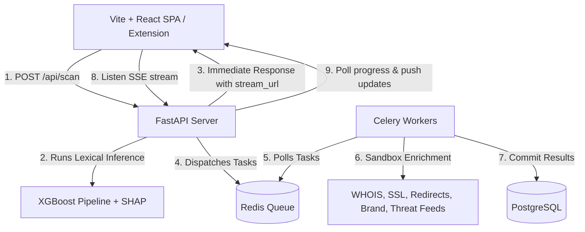

# 🛡️ PhishGarud

> **Decoupled Real-Time Threat Intelligence Platform & Explainable ML Phishing Link Detector**

PhishGarud is a production-grade, portfolio-defining cybersecurity threat intelligence platform built completely from scratch. Combining machine learning, asynchronous sandbox analysis, and Explainable AI (XAI) visualizations, PhishGarud protects users from deceptive URLs while providing an explainable audit trail.

---

## 🌟 Key Features

1. **Decoupled Architecture**: Separation of fast lexical ML classification (sub-200ms) from intensive network sandbox operations.
2. **Progressive Sandbox SSE Stream**: Network analytics (WHOIS history, SSL configurations, redirect hops, brand edit distances, and threat feed aggregators) run in parallel via Celery workers and Redis, streaming live updates to the UI via Server-Sent Events (SSE).
3. **Explainable AI (XAI) Dashboard**: Integration of game-theoretic SHAP (SHapley Additive exPlanations) values to isolate and explain the specific lexical weights driving every model verdict.
4. **Verdict Fusion Algorithm**: Combines static ML predictions with sandbox telemetry weights to compute final threat probability indicators.
5. **Chrome Extension Shield**: Manifest v3 browser extension running real-time tab inspections, badge updates (OK/WARN/RISK), and one-click deep-dive audit links.
6. **Robust Tooling Pages**: Supporting bulk CSV scans, email link extraction blocks, paginated historical audit logs, and feedback loops.

---

## 🛠️ Technical Stack & Architecture



*   **Frontend**: Vite + React 18 + TypeScript + Zustand + TailwindCSS + Framer Motion + Recharts.
*   **Backend**: FastAPI + SQLAlchemy (Async Postgres driver `asyncpg`) + Pydantic v2.
*   **Task Queue**: Redis + Celery.
*   **Database**: PostgreSQL 15.
*   **Reverse Proxy**: Nginx.
*   **Deployment**: Multi-container Docker Compose.

---

## 📊 Machine Learning Model Specifications

*   **Algorithm**: XGBoost Classifier.
*   **Features**: 30 lexical indicators extracted entirely offline (entropy, subdomains count, word lengths, TLD locations, etc.).
*   **Balancing**: Synthetic Minority Over-sampling Technique (SMOTE) applied strictly to the training split.
*   **Optimization**: 50 hyperparameter search trials using Optuna cross-validation.
*   **Metrics on Held-Out Test Set**:
    *   **Accuracy**: `94.19%` (Target: >=90%)
    *   **F1-Score**: `0.9471`
    *   **AUC-ROC**: `0.9831` (Target: >=0.95)

---

## 🚀 Quickstart Guide

### Prerequisites

*   Python 3.11+
*   Node.js 18+

### Running Locally

PhishGarud runs entirely locally with zero external dependencies (no PostgreSQL, Redis, Celery, or Nginx required). It leverages local thread executors and an SQLite file database.

1.  **Start Backend API Server**:
    Install requirements and run Uvicorn:
    ```bash
    cd backend
    pip install -r requirements.txt
    uvicorn main:app --port 8000
    ```
    This will auto-create and populate the SQLite database `phishgarud.db` in your `backend/` directory.

2.  **Start Frontend Web Application**:
    Install packages and start Vite:
    ```bash
    cd ../frontend
    npm install
    npm run dev
    ```
    Vite is configured with a built-in proxy to redirect all `/api` calls directly to your Uvicorn instance on port 8000.

3.  **Explore**:
    Navigate to `http://localhost:5173/` in your browser.

---

## 🧪 Testing Suite

We maintain unit test suites for all core backend components:

To execute tests locally (ensure dependencies are installed: `pip install -r backend/requirements.txt`):

```bash
cd backend
# Run lexical features tests
python -m unittest tests/test_features.py

# Run sandbox checkers integrations tests
python -m unittest tests/test_enrichment.py

# Run API routing endpoints tests
python -m unittest tests/test_api.py
```

---

## 📂 Repository Layout

```
.
├── backend/
│   ├── config.py           # App settings (SQLite paths)
│   ├── main.py             # FastAPI REST endpoints & local BackgroundTasks
│   ├── db/
│   │   ├── models.py       # SQLA engine-agnostic database schemas
│   │   └── session.py      # SQLite connection pools (async/sync)
│   ├── enrichment/         # Sandbox inspection libraries (WHOIS, SSL, redirects)
│   ├── ml/
│   │   ├── features.py     # 30-Lexical feature extractor
│   │   ├── train.py        # Model Optuna training script
│   │   ├── predictor.py    # XGBoost inference & SHAP loader
│   │   └── artifacts/      # Serialized ML & SHAP model files
│   └── tests/              # Backend Python unit tests
├── frontend/
│   ├── package.json        # Node dependencies configurations
│   ├── vite.config.ts      # Vite configuration (proxy mapped to port 8000)
│   ├── tailwind.config.ts  # Tailwind theme token definitions
│   └── src/                # React TypeScript client source components
└── extension_backup/       # Decoupled Chrome Extension backup (git-ignored)
```
